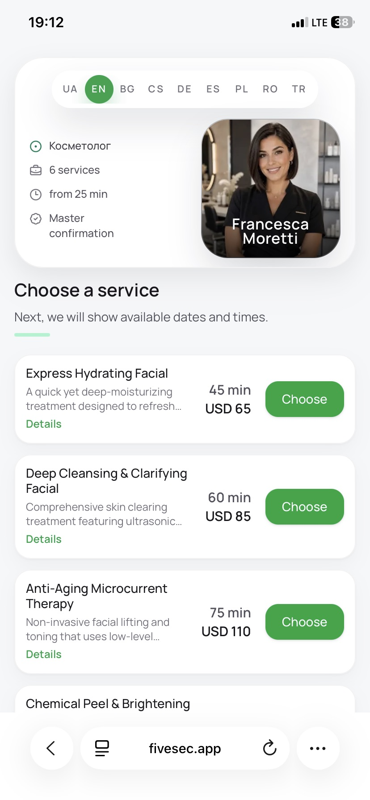
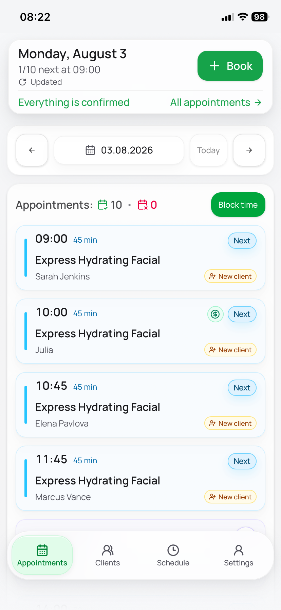
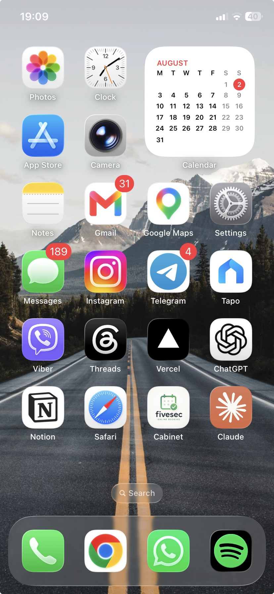

# Fivesec

Online booking platform for solo service professionals and small teams —
barbers, cosmetologists, trainers, and similar specialists who work with
clients by appointment.

🔗 **Live app:** [fivesec.app](https://fivesec.app)

> This is a showcase repository — documentation and visual materials only.
> Fivesec has real active specialists using it across Europe today, not a
> demo with seeded data.

---

## Screenshots

More screenshots and video walkthroughs in [docs/gallery.md](docs/gallery.md).

---

## Problem

Solo service professionals — barbers, cosmetologists, personal trainers —
typically run their booking through a mix of phone calls, Instagram DMs,
and memory. It works until it doesn't: double-bookings, forgotten
appointments, no client history, no way to see the week at a glance, and
constant manual back-and-forth just to agree on a time.

## Solution

Fivesec gives each specialist a personal booking link clients can use
directly — no app download, no account needed on the client side — paired
with a mobile-first cabinet where the specialist manages their schedule,
services, and client base from their phone. Availability is calculated
automatically from real constraints (working hours, exceptions, personal
time, service duration, existing bookings, timezone), so a client can only
ever book a slot that's genuinely open.

---

## Key Features

- **Personal public booking link** — service selection → available
  date/time → confirmation, no client account required
- **Mobile-first specialist cabinet** — today's bookings, full booking
  history with filters, manual booking creation, service management
- **Real availability logic** — weekly schedule, one-off exceptions,
  blocked personal time, service duration, and timezone all factored in
  together
- **Client base with history** — visit/cancellation/no-show tracking,
  multiple contact channels, notes, archive
- **Booking snapshot pattern** — a booking keeps the price/duration the
  client actually agreed to, even if the service changes later
- **Installable PWA with push notifications** — new bookings and daily
  summaries land directly on the specialist's home screen
- **Multilingual interface** — built for specialists and clients across
  different countries and languages

📖 **[User Guide](docs/business-guide.md)** — how a specialist runs their
booking flow day to day: schedule, services, clients, notifications.

🛠 **[Technical Highlights](docs/technical-highlights.md)** — architecture,
the availability-calculation logic, the booking snapshot pattern, and the
client data model.

---

## Tech Stack

Next.js 16 · React 19 · TypeScript · Prisma 6 · PostgreSQL · NextAuth v5 ·
next-intl · Tailwind CSS 4 · Radix UI · Web Push API · Cloudinary · Resend ·
Vercel Analytics
