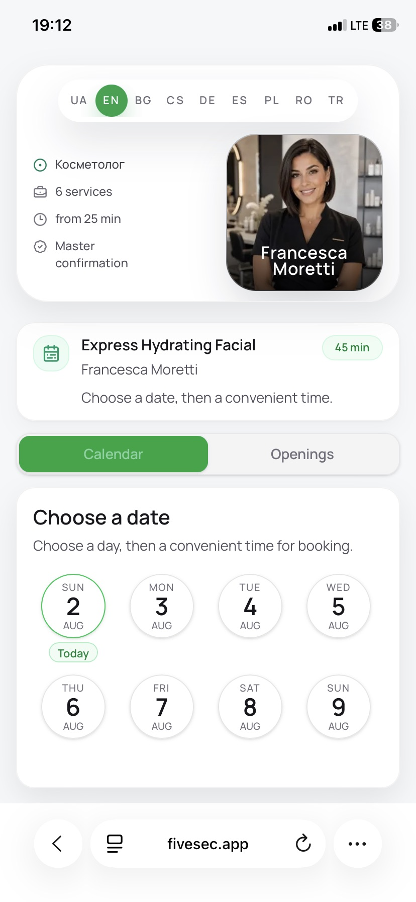
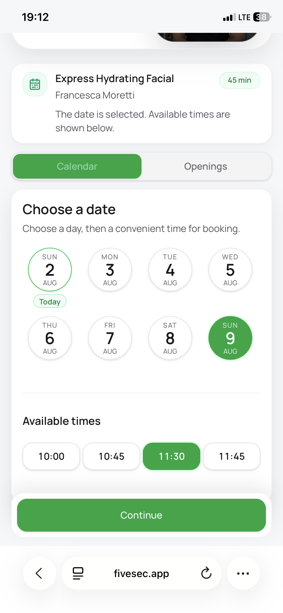
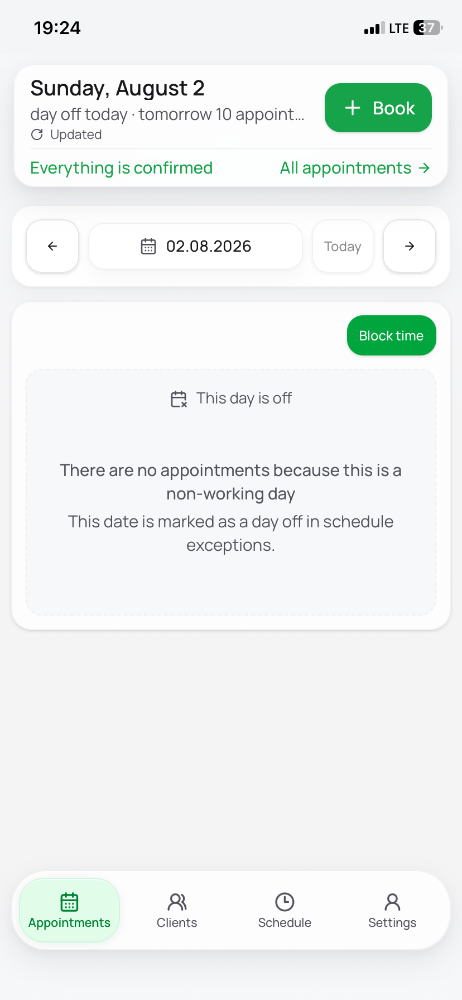
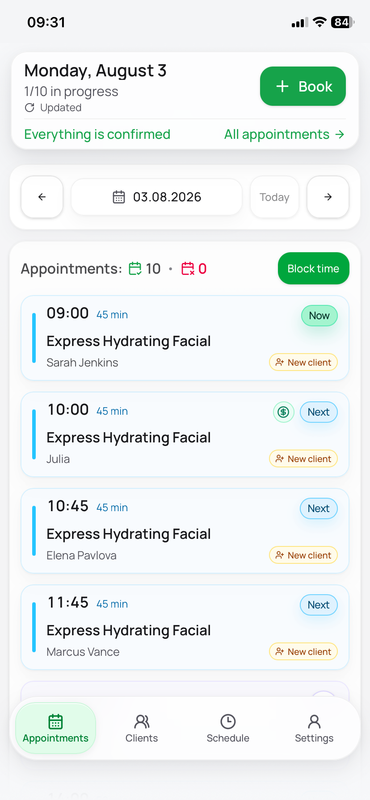
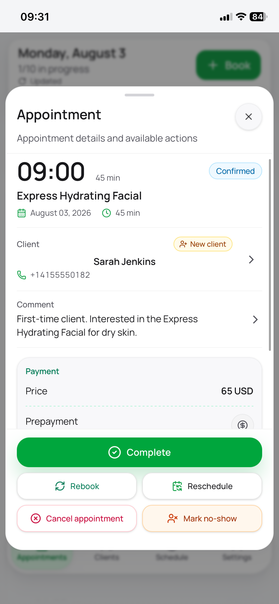

# Screenshots & Video Walkthroughs

Fivesec in action — public booking flow, specialist cabinet, and PWA
experience. Screenshots for a quick look, videos for the full flow.

> Live app: https://fivesec.app
> See also: [User Guide](business-guide.md) · [Technical Highlights](technical-highlights.md)

---

## Screenshots

### Public Booking Flow

#### Public Link — Services

First screen of the public booking link: services list, with the specialist's photo and a short bio at the top.

---

#### Public Booking — Select Date

Second step of public booking: date selection.

---

#### Public Booking — Select Time

Third step: available time slots for the selected date.

---

### Specialist Cabinet

#### Dashboard — Today's Bookings

The screen a specialist sees on launch: how many bookings today, when the next one is, and today's client list with status labels.

---

#### Dashboard — Day Off

Launch screen on a day off: the mini dashboard shows the day is blocked and how many clients are booked for tomorrow.

---

#### Current & Upcoming Bookings

Today's view showing which booking is currently in progress and what's coming up next.

---

#### Booking Detail Modal

Full booking details in a modal, with status controls and a reschedule action.

---

### PWA

#### Installed PWA Icon

Fivesec's icon on the home screen, alongside native apps — installed, not just bookmarked.

---

## Video Walkthroughs

### Public Booking Flow

#### Booking via Public Link

The full client flow through a specialist's public booking link — service, date/time, and confirmation.

https://github.com/user-attachments/assets/ff012742-1dc8-4d14-8aee-c671dbf94d67

---

#### Booking Confirmation

The confirmation screen a client sees right after submitting a booking.

https://github.com/user-attachments/assets/ef242bae-e250-4a8a-8b8a-5ab8f5a8412d

---

### Specialist Cabinet — Bookings

#### Browsing & Updating Bookings

Scrolling a day's booking list, marking a completed booking as successful, and opening a booking that's already closed to review it.

https://github.com/user-attachments/assets/1523fa82-2f7c-4519-86eb-db914e82c8b8

---

#### Creating a Client from the Cabinet

Registering a new client directly from the specialist's account, not through the public link.

https://github.com/user-attachments/assets/f8896f38-9681-41ab-9cfc-744da03b5b19

---

#### Rescheduling a Booking

Moving an existing booking to a different date.

https://github.com/user-attachments/assets/f232bc49-c78e-4a4c-9297-0f4c413b91a5

---

#### Marking a Prepayment

Searching for a booking in All Bookings and marking it as prepaid.

https://github.com/user-attachments/assets/207151f5-5867-40ac-bdff-637118aa65bc

---

### Clients

#### Editing Contact Channels

Adding a client's WhatsApp contact and setting it as their preferred contact method.

https://github.com/user-attachments/assets/3a98e94c-6f3d-4351-a89a-e3f7904e25e8

---

#### Client Search & History

Finding a client through the All Clients tab and viewing their booking history.

https://github.com/user-attachments/assets/5a5d685b-e048-4e78-aa77-fbe05f5fa6f4

---

### Schedule

#### Blocking Personal Time

Adding a personal time block to the daily schedule and showing how it removes that window from bookable slots.

https://github.com/user-attachments/assets/e71d2bc0-0c06-4a24-8560-37dd5ad1381c

---

#### Schedule & Exceptions

Editing the weekly work schedule and adding an exception day — then showing that date becomes unavailable on the public calendar.

https://github.com/user-attachments/assets/253d28e0-9690-42a4-bd70-3133ce589345

---

### Services

#### Creating & Editing a Service (Part 1)

Creating a new service and editing its details.

https://github.com/user-attachments/assets/de439ed8-8c54-45df-a201-6eba6c902029

---

#### Creating & Editing a Service (Part 2)

Continued: further editing of service details.

https://github.com/user-attachments/assets/074badc2-a8c2-471e-aec9-dcfc4600b1e1

---

### Settings

#### Settings — Font Size

The settings page, adjusting the interface font size.

https://github.com/user-attachments/assets/8a2698c4-705b-411c-af01-4ccba4251df6

---

#### Settings — Timezone & Currency

Configuring timezone, city, and currency for the specialist's account.

https://github.com/user-attachments/assets/1848f97a-6b0f-4746-891a-a369b2a40e98

---

### PWA & Notifications

#### Installing the PWA

Installing Fivesec as an app on a phone/tablet home screen.

https://github.com/user-attachments/assets/685ce9c5-f961-48eb-b69d-015b2c328bb2

---

#### Signing in to the Installed App

Logging into the account from the installed PWA.

https://github.com/user-attachments/assets/2abad708-5147-4536-8e89-0894f9581c85

---

#### Push Notifications

Enabling push notifications and receiving a live test notification.

https://github.com/user-attachments/assets/940158a1-ecad-444b-afa2-61c9b73ae051

---
